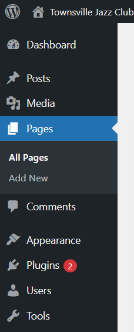
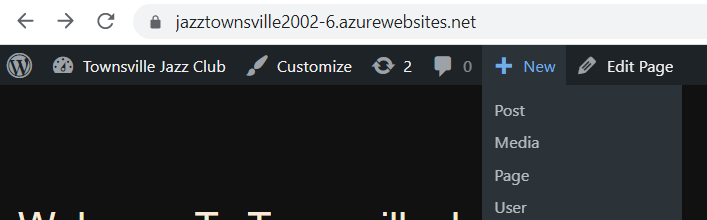

# Managing Jazz Townsville

## Accessing WordPress Admin
To access the WordPress Admin functionality, you will need to type in the URL
for the site that you are accessing. E.G: 
Once this has been inputted it will ask for a username and password
to the admin section. (You should already have this information stored). After
logging in you will be redirected to the WordPress Dashboard.

## Adding New Content

### **Creating a New Page**

To add a new page to the site, click on Pages in the Dashboard and then 
click Add a New page.

However, if you are still viewing the website from a visitor's perspective
you can click the **+ New** section. 

To edit an existing page, click on the _Page_ section of the Sidebar 
and select _All Pages_. Then click on name of the page you wish to edit,
the _Editor_ will then open where you can add text, 
images, buttons, and any other content for the page.

### **Creating a Post**

Go to the _Posts_ section in the Dashboard sidebar, to add a new post
click the **"Add New"** section at the top.

Once you’ve clicked **"Add New"** it will take you to the WordPress Editor, 
where you can create the content you want to show on the new post. 

Here you can:

- 1. Write the text content of the post.
- 2. Add images to the post.
- 3. Categorise the post.
- 4. Apply tags to the post.
- 5. Upload a featured image (This is the image that appears on your
blog post list page.

When you have added the content you want,
click the _Publish_ button in the top right corner of the editor to
publish the new blog post to the blog.

## Plugins
#### [All-in-one Migration](https://wordpress.org/plugins/all-in-one-wp-migration/)
The All-in-one migration plug-in allows the user to export their WordPress site as a whole
and deploy it into a staging site or even take out/ pick apart certain aspects of the site.

#### [Photo Gallery](https://wordpress.org/plugins/photo-gallery/)
Photo Gallery is an easy-to-use image/ gallery builder that is customizable and mobile-friendly.
It is packed with powerful functionality, allowing you to create anything from simple to complex photo galleries.